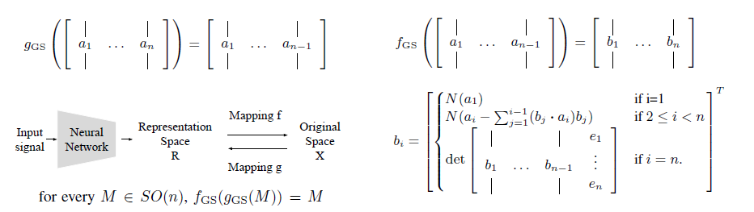
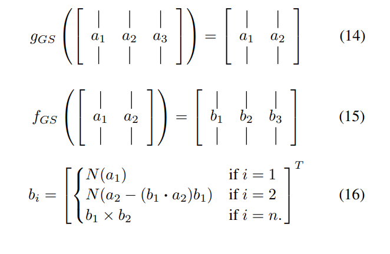

# 6d_rot_tensorflow
6D rotation representation (["On the Continuity of Rotation Representations in Neural Networks"](https://arxiv.org/abs/1812.07035)) for tensorflow.

### Environment 
This code is implemmented and tested with [tensorflow](https://www.tensorflow.org/) 1.11.0. \
I didn't use any spetial operator, so it should also work for other version of tensorflow.

### Usage
Just add the tf_rotation6d_to_matrix after your output, whose last dimension of tensor should be 6.
```
"""
Any model output whose last dimension is 6.
e.g. output = tf.layers.dense(hidden, 6)
"""
rot = tf_rotation6d_to_matrix(output)
```

I very simple example of transformation between 6D continuous representation and SO(3) can be found in `example.py`

### Details
Here I crop some parts of the context from the paper, FYI.

According to the Section 3 and 4 of the paper, the target transformation between continuous representation and SO(n) can be formulate as follows. It's derived based on a Gram-Schmidt process.

</a>

If you found it looks a little bit complicated, you can directly go to Appendix B. There is a very simple formulation of the 6D and SO(3). 

</a>

Besides, according to the features of rotation matrix, the formulation can be quite concise. You can found the concise transformation between 6D and SO(3) in the source code.

### Contact & Copy Right
Code work by Jia-Yau Shiau <jiayau.shiau@gmail.com>.

